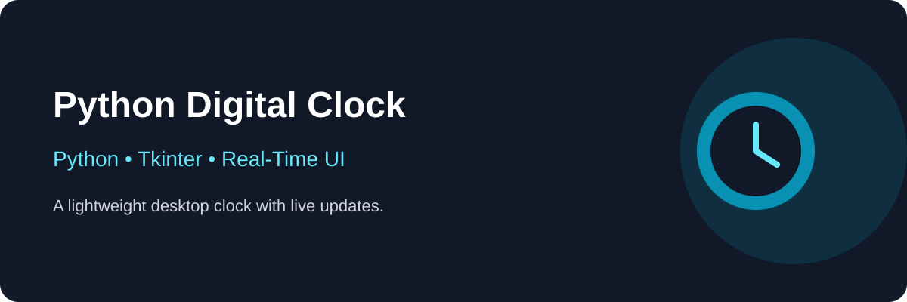

# 🕐 Python Digital Clock



> **A lightweight real-time desktop clock built with Python and Tkinter.**

[](https://www.python.org/) [](https://docs.python.org/3/library/tkinter.html)

## 🚀 Overview

Displays the current time and date in a Tkinter window and refreshes automatically every second.

## ✨ Features

- ⏱️ Real-time clock
- 📅 Current date
- 🔄 One-second refresh
- 🖥️ Desktop GUI
- ⚡ Lightweight

## ⚙️ Workflow

```text
Create Window → Read Time → Update UI → Wait 1 Second → Repeat
```

## ▶️ Run

```bash
python main.py
```

## 🧰 Tech Stack

**Python · Tkinter · time.strftime() · after()**

## 🧠 Skills Demonstrated

- Tkinter GUI development
- Date/time formatting
- Dynamic UI updates
- Scheduled callbacks
- Event-driven programming

## 🔧 Future Improvements

- 12/24-hour switching
- Timezone selection
- Themes
- Alarm
- Stopwatch/timer

## 👨‍💻 About

**Amjid Khan** — Python developer focused on **web scraping, Selenium automation, and practical Python development**.

- 💼 [LinkedIn](https://linkedin.com/in/amjid-khan-69231a397/)
- 📧 `contact.amjid.freelancer@gmail.com`

---

⭐ **If you find this project useful, consider giving it a star!**